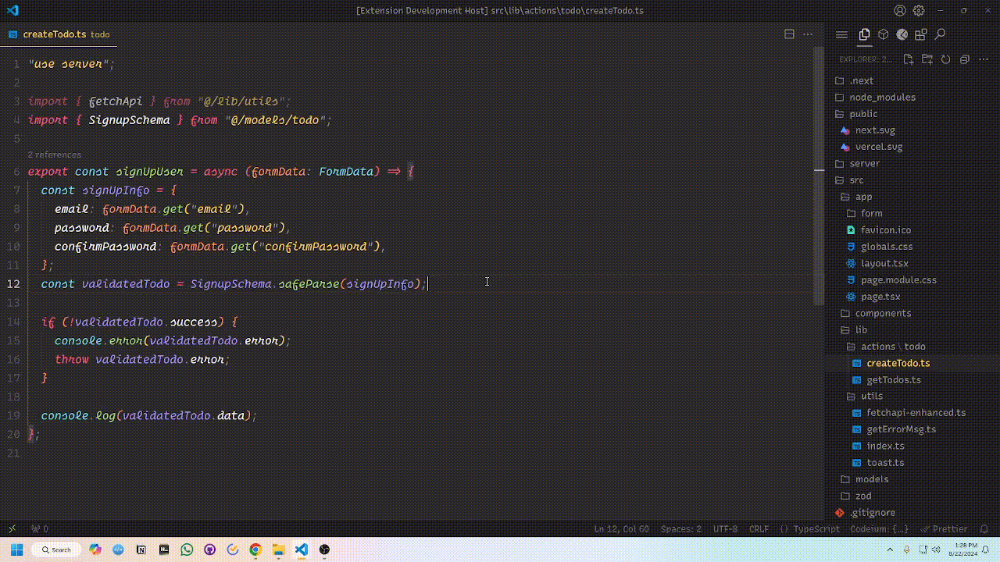

  

<h1 style="text-align: center">Kawaiicon</h1>
<h4 style="text-align: center">Make your <a href="https://code.visualstudio.com">Visual studio code</a> look kawaii (cute).</h4>

## About

Multiple Vscode icons you like? But end up installing too many extensions? I got you covered. Kawaiiicon is a set of kawaii (cute), minimal & material icons for vscode. Inspired by [vscode-icons](https://marketplace.visualstudio.com/items?itemName=vscode-icons-team.vscode-icons), [Material Icon Theme](https://marketplace.visualstudio.com/items?itemName=PKief.material-icon-theme), [Bearded Icons](https://marketplace.visualstudio.com/items?itemName=BeardedBear.beardedicons) & [Glyph for vscode](https://marketplace.visualstudio.com/items?itemName=lewxdev.vscode-glyph).

> [!NOTE] I want to make it better in the future. If an icon is missing, should be added, or you have any suggestion please create an issue or contribute! :)

## Installation

To install Kawaiicon:

1. Go to [marketplace](https://marketplace.visualstudio.com/items?itemName=IkramHussainSiyam.kawaiicon-vscode-icon)
1. Click install.
1. Select your favorite icon from the list.
1. Usage:
   - Linux & Windows => `File > Preferences > Theme > File Icon Theme > VSCode Icons.`
   - MacOS => `Code > Preferences > File Icon Theme > VSCode Icons.`
     

### You're all set, Enjoy 🎉
